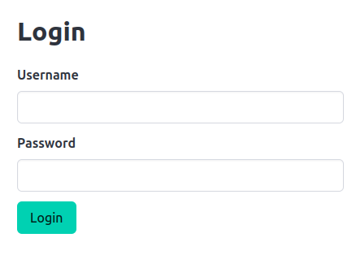

# MintyPHP Forms

MintyPHP Forms is a powerful PHP form builder that enables you to create and validate forms without having to write a lot of boilerplate code.

## Features

- Bulma renderer, easily creating good looking forms
- Validation rules, such as validating email, string length and numeric comparisons
- Support checkbox arrays and multi selects
- Best practices: follows best practices, well-tested, object oriented code
- Extensible: create support for your favorite framework or form rendering style

## Installation

Run the following command to install MintyPHP Forms with Composer.

```bash
composer require mintyphp/forms
```

The package has no dependencies on other packages.

## Quick Start

Add the following to alias the most used classes in your PHP file:

```php
use MintyPHP\Form\Elements as E;
use MintyPHP\Form\Validator\Validators as V;
```

Now ensure all classes are (auto)loaded:

```php
require_once 'vendor/autoload.php';
```

And create a simple login form using:

```php
$form = E::form([
    E::field(E::text('username'),E::label('Username'),[V::required('Username is required')]),
    E::field(E::password('password'),E::label('Password')),
    E::field(E::submit('Login')),
]);
```

Now render the form using:

```php
$form->render();
```

And the output is:

```html 
<form method="post">
  <div>
    <label for="username">Username</label>
    <input id="username" type="text" name="username" value=""/>
  </div>
  <div>
    <label for="password">Password</label>
    <input id="password" type="password" name="password" value=""/>
  </div>
  <div>
    <input type="submit" value="Login"/>
  </div>
</form>
```

Easy as that.

## Frontend frameworks

MintyPHP Forms has support for the Bulma framework right out of the box. 
Just tell MintyPHP Forms that you want to use Bulmas style forms using:

```php
E::$style = 'bulma';
// create and render the login form
$form = E::form([
    E::field(E::text('username')->required(), E::label('Username')),
    E::field(E::password('password'), E::label('Password')),
    E::field(E::submit('Login')),
]);
$form->render(true);
```

And the output will be form in the familiar Bulma style:

```html 
<form method="post">
  <div class="field">
    <label class="label" for="username">Username</label>
    <div class="control">
      <input id="username" class="input" type="text" name="username" value="" required="required"/>
    </div>
  </div>
  <div class="field">
    <label class="label" for="password">Password</label>
    <div class="control">
      <input id="password" class="input" type="password" name="password" value=""/>
    </div>
  </div>
  <div class="field">
    <div class="control">
      <input class="button is-primary" type="submit" value="Login"/>
    </div>
  </div>
</form>
```

In the future we will add support for other frameworks, such as bootstrap 5.

## Backend frameworks

This package has been tested with the MintyPHP backend framework. It can also be used with other frameworks as this package has no dependencies at all.

Although we don't recommend you to use MintyPHP Forms without a backend (or frontend) framework, it is certainly possible, see the full example.

## Full example

The Form object has the following data methods:

- **fill**: Fill the form with an array of data (e.g. $_POST)
- **validate**: Validate the form and add errors where needed
- **addErrors**: Add custom errors (after validation)
- **extract**: Extract the filled in form values
- **render**: Output the form with or without root element

These data methods are typically used on GET:

- GET:
  - fill (with default values or from database)
  - render
- POST: 
  - fill (from POST data)
  - validate
    - on success: extract
    - on errors: render

You can see how these are used in the following full example:

[Full example - PHP code - Click here](example.php)

After filling in a password and clicking "Login" it renders as:



Interested? Read the rest of the [documentation](docs/overview.md).
